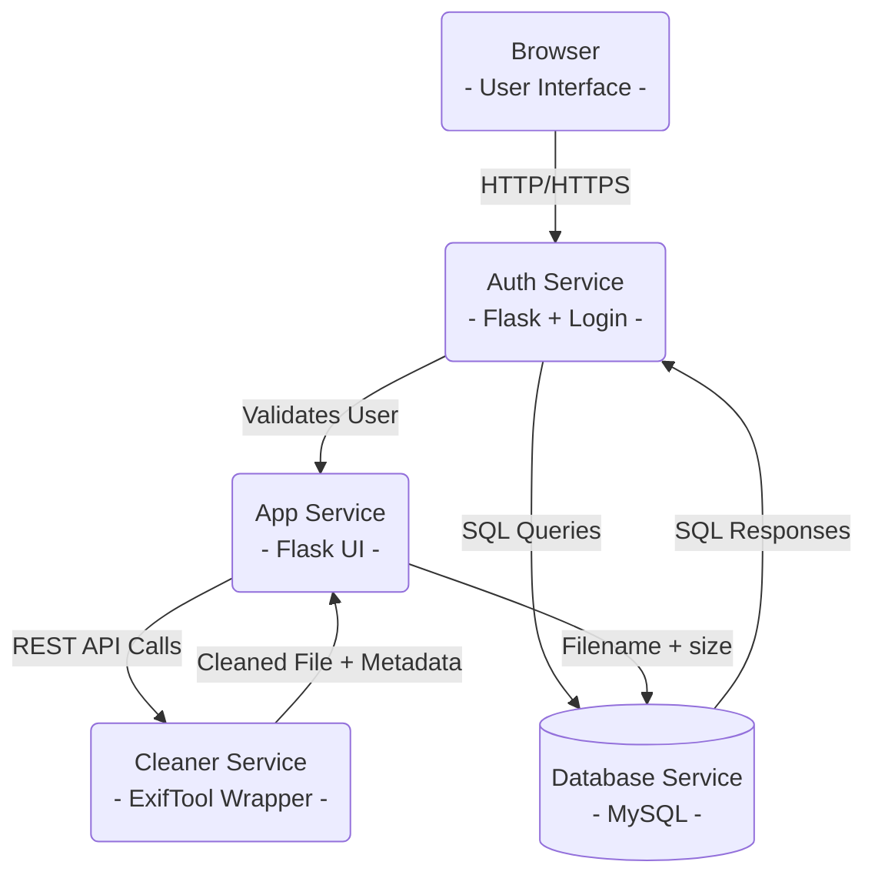

# Image MetaCleaner - Documentation

## Table of Contents
[Description of the Software](#description-of-the-software)

&nbsp;&nbsp;&nbsp;&nbsp;&nbsp;&nbsp;[Main Features](#main-features)

[Software Architecture Design](#software-architecture-design)

&nbsp;&nbsp;&nbsp;&nbsp;&nbsp;&nbsp;[Components & Responsabilities](#components--responsabilities)

&nbsp;&nbsp;&nbsp;&nbsp;&nbsp;&nbsp;[Communincation](#communication)

&nbsp;&nbsp;&nbsp;&nbsp;&nbsp;&nbsp;[Dataflow Diagram](#dataflow-diagram)

[Folder Structure](#folder-structure)

[Makefile Overview](#makefile-overview)

[Setup](#setup)

&nbsp;&nbsp;&nbsp;&nbsp;&nbsp;&nbsp;[1. Clone the GitHub repository](#1-clone-the-github-repository)

&nbsp;&nbsp;&nbsp;&nbsp;&nbsp;&nbsp;[2. Configure Kubernetes Secrets](#2-configure-kubernetes-secrets)

&nbsp;&nbsp;&nbsp;&nbsp;&nbsp;&nbsp;[3. Setting up Kubernetes](#3-setting-up-kubernetes)

&nbsp;&nbsp;&nbsp;&nbsp;&nbsp;&nbsp;[4. Deploying the app in the Kubernetes Cluster](#4-deploying-the-app-in-the-kubernetes-cluster)

&nbsp;&nbsp;&nbsp;&nbsp;&nbsp;&nbsp;[Optional: Local Docker Compose](#optional-local-docker-compose)


## Description of the Software
MetaCleaner is a microservices-based web application that allows users to upload images, preview their metadata, clean/remove metadata (e.g., GPS location, camera info), and download the cleaned file.

> The application is built using **Flask**, **MySQL**, **Python** and **ExifTool**, and deployed using Kubernetes.

---

### Main Features
- User authentication (signup/login/logout).
- Upload only image files (PNG, JPG, JPEG. GIF).
- Preview metadata before and after cleaning.
- Clean sensitive metadata with an isolated cleaner microservice.
- Download the cleaned file.
- View history of cleaned files with size differences.
- Persistent database (storage for users and history records) across restarts.
- Configurable and scalabe via Kubernetes.

---
## Software Architecture Design
### Components & Responsabilities
- Auth microservice
    - Handles signup/login/logout.
    - Validates credentials.
    - Hashes passwords before storing them.
    - Used DB for user data.
- App microservice (Frontend/UI)
    - Handles web requests from users.
    - Provides pages: login, signup, index, history.
    - Orchestrates requests: uploads files, calls cleaner, stores results in DB.
- Cleaner microservice
    - Stateless microservice wrapping `exiftool` for metadata cleaning.
    - Provides REST API endpoints:
        - `/metadata` -> returns metadata of an image.
        - `/clean` -> removes metadata and returns cleaned file (Base64).
- Database microservice (MySQL)
    - Stores user accounts and file history.
    - Runs as stateful service with persistent volume claim (PVC).

> System level architecture of the MetaCleaner application.



### Communication
- App **<->** Cleaner via REST API.
- App **<->** Auth via internal Flask/DB calls.
- App **->** DB via SQL queries.
- Auth **<->** DB via SQL queries.

### Dataflow Diagram
> The diagram below, shows the dataflow between the different services of **MetaCleaner**.

```mermaid
flowchart TD
    Browser(Browser<br/>- User interface -) e1@==>|1. Login request| Auth(Auth Service<br/>- Flask + Login -)
    App e8@==> |8. Filename and size | DB
    Auth e2@==>|2. Verify user via SQL queries| DB[(Database Service<br/> - MySQL -)]
    DB e3@==>|3. SQL responses - user record| Auth
    Auth e4@==>|4. Session cookie / JWT| Browser
    Browser e5@==>|5. Authenticated requests - with session| App(App Service<br/>- Flask UI -)
    App e6@==>|6. REST API calls| Cleaner(Cleaner Service<br/> - ExifTool Wrapper -)
    Cleaner e7@==>|7. REST API responses| App
    
    classDef animate stroke-dasharray: 9,5,stroke-dashoffset: 900,animation: dash 25s linear infinite;
    class e1 animate; class e2 animate; class e3 animate; class e4 animate; class e5 animate;
    class e6 animate; class e7 animate; class e8 animate
 ```
 
## Folder Structure
> This section provides an overview of the folder structure for **MetaCleaner**.

```
image-MetaCleaner/
|
├── app.py                         # Flask entrypoint
├── db.py                          # Database connection helper
├── models.py                      # SQLAlchemy models
├── requirements.txt               # Python dependencies
├── Dockerfile                     # App image build context
├── Makefile                       # Kubernetes automation targets
├── docker-compose.template.yml    # Local compose template (placeholders)
├── auth/                          # Authentication blueprint
|   ├── __init__.py
|   └── routes.py                  # Auth routes
|
├── main/                          # Main application blueprint
|   ├── __init__.py
|   └── routes.py                  # UI routes
|
├── templates/                     # Jinja2 templates
|   ├── base.html
|   ├── history.html
|   ├── index.html
|   ├── login.html
|   └── signup.html
|
├── static/                        # Static assets
|   ├── favicon.ico
|   ├── logo.png
|   └── styles.css
|
├── cleaner-service/               # Cleaner microservice
|   ├── cleaner.py
|   ├── dockerfile
|   └── requirements.txt
|
├── database/                      # Custom MySQL image files
|   ├── Dockerfile
|   ├── entrypoint.sh
|   └── scripts/
|       └── create_table.sql
|
└── k8s/                           # Kubernetes manifests
    ├── app.yaml
    ├── cleaner.yaml
    ├── db-init.yaml
    ├── db-pvc.yaml
    ├── db.yaml
    ├── ingress.yaml
    ├── namespace.yaml
    └── secrets.template.yaml      # Placeholder secret template
```

## Makefile Overview
> Overview of the commands available in the **Makefile** and their description.

| Command         | Description |
|:----------------|:-----------|
| `make apply`           | Apply all manifests in the *yaml* files including the **PVC** |
| `make check-secrets-file` | Ensure the secrets manifest **secrets.local.yaml** exists before applying resources |
| `make deploy`          | Creates the namespace and apply all the manifests |
| `make down`            | Tears down the workload but keep the **PVC** for data persistence |
| `make logs-app`        | Shows the logs from the **App service** |
| `make logs-cleaner`    | Shows the logs for the **Cleaner service** |
| `make logs-db`         | Shows the logs for the **Database service** |
| `make namespace`       | Creates the namespace `metacleaner` |
| `make purge`           | Fully removes cluster resources including the **PVC** |
| `make status`          | Display the status of the cluster |

## Setup
> To simplify common development tasks, I provided a **Makefile**. Instead of running long `kubectl` commands, you can use the shortcuts provided in [Makefile Overview](#makefile-overview) section.

### 1. Clone the GitHub repository

```bash
git clone https://github.com/Ahmed-2-S/image-MetaCleaner.git
cd image-MetaCleaner
```

### 2. Configure Kubernetes Secrets
1. Copy the template `secrets.template.yaml` to a local file, called `secrets.local.yaml` (the copy stays untracked by Git). Fill in real values by replace each **REPLACE_\*** placeholder with your actual database credentials, API key, and a strong Flask **SECRET_KEY**:

    ```bash
    cp k8s/secrets.template.yaml k8s/secrets.local.yaml
    ```

    ``` bash
    nano k8s/secrets.local.yaml
    ```

> Here is `nano` used as text editor, you can open the file using your preferred text editor.

### 3. Setting up Kubernetes
1. After replacing the placeholders **REPLACE_\***, you can now start **Docker Desktop** and go to the **Kubernetes** tab. The configuration option shown in the image below, is what has been used to test and deploy the app. Click on `Create`.

    

2. You can click on `install` and wait for the cluster to be created.

    

### 4. Deploying the app in the Kubernetes Cluster
1. Run the `make deploy` command to deploy the application in the cluster.

    

2. Before accessing the web page of the application, make sure the database service has been correctly initialized by running `make logs-db`. In the terminal look for similar output:

    

3. When you can spot the highlighted text above in the terminal, then you can now access the web page of the application on [http://localhost:30000](http://localhost:30000).

<!-- 2. Apply the secret before deploying workloads:

   ```bash
   kubectl apply -f k8s/secrets.local.yaml
   ```

3. Alternatively generate the secret on the fly (idempotent example):

   ```bash
   kubectl create secret generic metacleaner-secrets \
    --namespace metacleaner \
    --from-literal=DB_HOST=metacleaner-db \
    --from-literal=DB_PORT=3306 \
    --from-literal=DB_USER=REPLACE_DB_USERNAME \
    --from-literal=DB_PASSWORD=REPLACE_DB_PASSWORD \
    --from-literal=DB_NAME=REPLACE_DB_NAME \
    --from-literal=CLEANER_API_KEY=REPLACE_CLEANER_API_KEY \
    --from-literal=SECRET_KEY=REPLACE_FLASK_SECRET_KEY \
    --dry-run=client -o yaml | kubectl apply -f -
    ``` -->

### Optional: Local Docker Compose
1. Copy the template to keep secrets local:
   ```bash
   cp docker-compose.template.yml docker-compose.yml
   nano docker-compose.yml  # fill in REPLACE_* values
   ```

2. Replace placeholders like `REPLACE_DB_USER`, `REPLACE_DB_PASSWORD`, `REPLACE_DB_ROOT_PASSWORD`, and `REPLACE_FLASK_SECRET_KEY` with your actual local values.

3. Update `db.py` so the fallback values (`REPLACE_USER`, `REPLACE_PASSWORD`) match the credentials from step 2.

4. **IMPORTANT** - Rename the dockerfile inside the database folder (`/database/Dockerfile`) to e.g., (`/database/Dockerfile.original`) and create a new file with the name `Dockerfile`. In this new file paste in the following docker commands:

    ```docker
    FROM mysql:8.0.43-bookworm

    # Set default DB
    ENV MYSQL_DATABASE=dbMetaCleaner

    # Copy init script
    COPY ./scripts/ /docker-entrypoint-initdb.d/
    ```

5. The generated `docker-compose.yml` is ignored by Git, so credentials never leave your machine.

6. Now you can run the application using the following command:

    ```bash
    # The -f [FILENAME] is to be more specific about which compose file to use
    docker compose -f docker-compose.yml up
    ```

    or just run the following if you have only one compose file in your working directory:

    ```bash
    docker compose up
    ```

7. Now just wait for docker to wire everything up and look for those two lines in the terminal, in the following order:

    ```bash
    db-metacleaner | [DATE_AND_TIME] 0 [System] [MY-011323] [Server] X Plugin ready for connections. Bind-address: '::' port: 33060 ...

    db-metacleaner | [DATE_AND_TIME] 0 [System] [MY-010931] [Server] /usr/sbin/mysqld: ready for connections. Version: '8.0.43' ...
    ```

    This means that the database server is ready and you can use the application correctly. Prior to seeing those two lines, the web application would not work, since it depends on the correct startup of the database.
    
8. Now you can access the application through [http://127.0.0.1:5000](http://127.0.0.1:5000) (as it was displayed in the terminal before the startup of the database).
